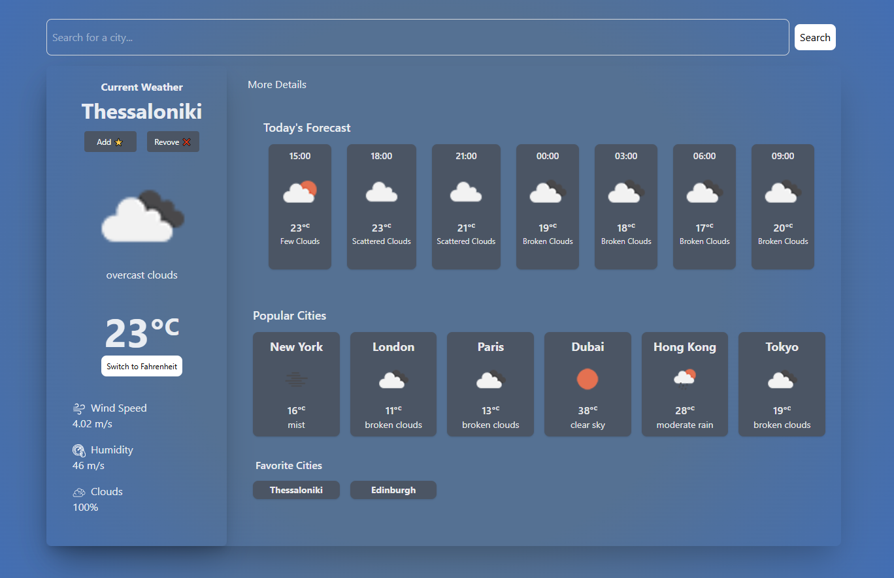

# Weather App

Το **Weather App** είναι μια εφαρμογή καιρού βασισμένη στην βιβλιοθήκη React και το Vite. Παρέχει πληροφορίες για τον τρέχοντα καιρού και προβλέψεις 5 ωρών για οποιαδήποτε πόλη, χρησιμοποιώντας το OpenWeatherMap API.

## Χαρακτηριστικά

- **Τρέχουσες Καιρικές Συνθήκες**: Εμφάνιση θερμοκρασίας, υγρασίας, ταχύτητας ανέμου και περιγραφής καιρού.
- **Προβλέψεις 5 Ωρών**: Εμφάνιση πρόβλεψης καιρού για τις επόμενες 5 ώρες με εικονίδια και θερμοκρασίες.
- **Εναλλαγή Μονάδας Θερμοκρασίας**: Δυνατότητα αλλαγής μεταξύ Κελσίου (°C) και Φαρενάιτ (°F).
- **Προσαρμοσμένα Εικονίδια**: Χρήση προσαρμοσμένων εικονιδίων για τις καιρικές συνθήκες.
- **Αγαπημένων πόλεων**: Δυνατότητα αποθήκευσης αγαπημένων πόλεων για γρήγορη πρόσβαση.
- **Responsive Design**: Βελτιστοποιημένο για χρήση σε κινητές συσκευές και υπολογιστές.
- **Αφαίρεση favorite cities**: Δυνατότητα αφαίρεση favorite cities.
- **LocalStorage**: Αποθήκευση αγαπημένων πόλεων.

## Τεχνολογίες

- **React**: Για τη δημιουργία του UI.
- **Vite**: Για γρήγορη ανάπτυξη και build.
- **OpenWeatherMap API**: Για την ανάκτηση δεδομένων καιρού.
- **Tailwind CSS**: Για το στυλ της εφαρμογής.
- **ESLint**: Για τη διατήρηση του καθαρού και συνεπούς κώδικα.

## Πώς να Εκτελέσετε το Project

1. Κλωνοποιήστε το αποθετήριο:
   ```bash
   git clone <https://github.com/Tsagiannoudis/weather-react>
   ```
   *Σημείωση: Αυτό θα δημιουργήσει έναν φάκελο με όνομα `weather-react`.*
2. Μεταβείτε στον φάκελο του project:
   ```bash
   cd weather-app
   
3. Εγκαταστήστε τις απαραίτητες εξαρτήσεις:
   ```bash
   npm install
   
4. Δημιουργήστε ένα αρχείο .env και προσθέστε το API key σας στον φάκελο του project (`weather-react/.env`):
   ```env
   VITE_API_KEY=ΤΟ_API_KEY_ΣΑΣ_ΑΠΟ_OPENWEATHERMAP_ΕΔΩ
   
5. Εκτελέστε την εφαρμογή:
   ```bash
   npm run dev
   ```
   *Η εφαρμογή θα είναι συνήθως διαθέσιμη στη διεύθυνση `http://localhost:5173`*


## Μελλοντικές Βελτιώσεις 
- Προσθήκη προβλέψεων για περισσότερες ημέρες.
- Βελτίωση του UI/UX.

## Στιγμιότυπο Οθόνης



------------------------------------------------------------------------------------

# Weather App

**Weather App** is a weather app based on the React library and Vite. It provides current weather information and 5-hour forecasts for any city, using the OpenWeatherMap API.

## Features

- **Current Weather Conditions**: show temperature, humidity, wind speed and weather description.
- **5 Hour Forecast**: show weather forecast for the next 5 hours with icons and temperatures.
- **Temperature Unit Switch**: Ability to switch between Celsius (°C) and Fahrenheit (°F).
- **Custom Icons**: Use custom icons for weather conditions.
- **Favorite Cities**: Allows users to save favorite cities for quick access.
- **Responsive Design**: Optimized for use on mobile devices and computers.
- **Remove favorite cities**: Ability to remove favorite cities.
- **LocalStorage**: Saves favorite cities.

## Technologies

- **React**: For creating the UI.
- **Vite**: For fast development and build.
- **OpenWeatherMap API**: For retrieving weather data.
- **Tailwind CSS**: For styling the application.
- **ESLint**: For maintaining clean and consistent code.

## How to Run the Project

1. Clone the repository:
   ```bash
   git clone <https://github.com/Tsagiannoudis/weather-react>
   ```
   *Note: This will create a folder named `weather-react`.*
2. Go to the project folder:
   ```bash
   cd weather-app
   
3. Install the necessary dependencies:
   ```bash
   npm install
   
4. Create an .env file and add your API key to the project folder (`weather-react/.env`):
   ```env
    VITE_API_KEY=Your_API_KEY_AS_OPENWEATHERMAP_HERE
   
5. Run the application:
   ```bash
   npm run dev
    ```

   *The application will usually be available at `http://localhost:5173`*

## Future Improvements 
- Add predictions for more days.
- UI/UX improvement.

## Screenshots
